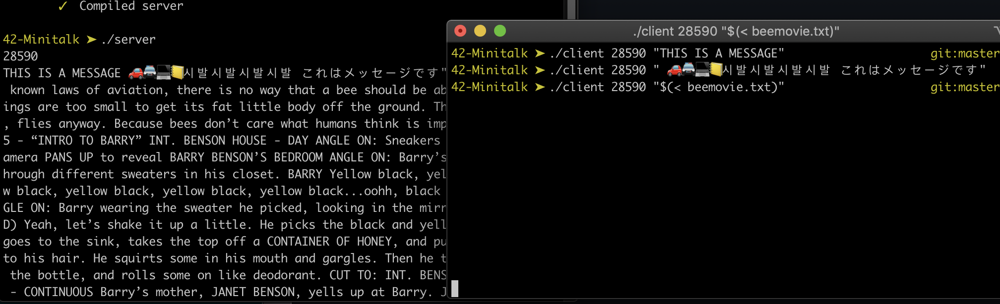

# Minitalk

</img>

**Project Goal**

This is a communication project, sending messages from one process to another using only UNIX Signals.
The two allowed signals are `SIGUSR1` and `SIGUSR2`. No other signals should be used and/or handled (interrupts/terminates are ignored).
The server displays it's *PID* (Process ID) upon launch, and stays active until the client attempts to message.

**Approach**

Having spoken about this project with other peers, the most obvious and simple method of sending a character string would be to send
*n* amount of signals of the signal type `SIGUSR1`. When it reaches the correct Ascii value, it sends a signal of type `SIGUSR2` to indicate the end of a string.

This method however is very slow, sending characters with a high Ascii value translates to 127 signals maximum per character. 
Having a quick look at the bonus assignment which involves unicode, the amount of signals increases drastically.
According to the subject PDF it is unacceptable to send approximately 100 characters in more than a second.

Characters are also represented in hexadecimal values, so i figure the amount of signals could be brought down more to a maximum of 34 signals per character.
16 signals for the first hexadecimal character, and 16 for the second. Add two and you've got the ending delimiters of the first and second characters.

This is noticably faster, but not fast enough. Let's have a look at the raw bits of a character with value `'A'`: `01000001`.
Because binary is represented by zeroes and ones, we can just send these characters bit by bit, reducing the signal count to only 8. We don't even need to indicate the ending as the server can keep note of the bit count.

One final fix i implemented was the encoding of the client *Header*, which is simply a 32-bit *integer* holding the length of the string.
By allocating memory for the string to be printed. Calling `write()` redundantly impacts performance, i defined `BUFFER_SIZE` which can be set to any number. It serves as a limit for the write function. Writing *128* characters all in one go is fast, and takes about 0.28 seconds.

Using this method, unicode characters (Bonus assignment) are automatically handled. Signal feedback/confirmation (Also a bonus) is a MUST even for the mandatory part, if you want to have a stable program.

🏁 **Project Grade: 125/100**

# Compiling

running `make` will compile on any MacOS system.
Bonus arguments have been ignored as bonuses are integrated in the mandatory part.

# Usage

`./server`                    -   Start the server
`./client <PID> <MESSAGE>`    -   Send a message to the server

